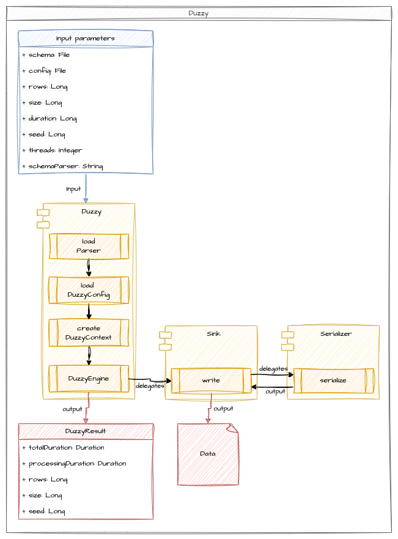

<p align="center">
  
</p>
<h1 align="center">
  Give me your schema, <br />I'll give you your test data.
</h1>


Duzzy is a data generation tool that aims to facilitate the generation of test data.  
Duzzy is designed to be as simple as possible, able to run without any parameters (which means that every parameter has a default value) but fully configurable and expandable: easy to start up, easy to tune.

## 🤔 Why Duzzy?
>"Do you have a dataset to test this pipeline?"  
>"I need data to test my job."  
>"I can't reproduce this bug without data."  
>"Do you know how to publish a relevant message into this Kafka topic?"  
>"Do you have a parquet file to test that case?"  

Have you ever heard these sentences, or perhaps you have already said them?

Generating data shouldn't be a complicated, time-consuming or boring task.  
Duzzy aims to solve these problems and provide a no-brainer way to generate data to meet your need.  
So now, when you need data: duzzy it!

## 🚀 Getting started
♨️ Duzzy is built with Java 21, so you need java 21 to run it. ♨️

### Install latest version
```
DUZZY_VERSION=0.0.0
wget "https://github.com/bhagenbourger/duzzy/releases/download/v${DUZZY_VERSION}/duzzy-${DUZZY_VERSION}.zip"
unzip duzzy-${DUZZY_VERSION}.zip
```

### Run it
```
"duzzy-${DUZZY_VERSION}/bin/duzzy run"
```
Output:
```
{"BooleanRandomProvider":false,"AlphanumericRandomProvider":"MlPmlTBiF2CLP","DoubleRandomProvider":8.253334924246401E307}
{"BooleanRandomProvider":true,"AlphanumericRandomProvider":"Oi8hyywQHTzL","DoubleRandomProvider":1.692914720729387E307}
{"BooleanRandomProvider":true,"AlphanumericRandomProvider":"cI9PmIuBGlqLJ2","DoubleRandomProvider":1.2628298023208332E307}
{"BooleanRandomProvider":true,"AlphanumericRandomProvider":"9NGrpMPDoT","DoubleRandomProvider":1.507758284837767E308}
{"BooleanRandomProvider":false,"AlphanumericRandomProvider":"RP2RAqZqnzE","DoubleRandomProvider":1.7268510135708793E308}
{"BooleanRandomProvider":true,"AlphanumericRandomProvider":"YGzKyAjT0kYk","DoubleRandomProvider":1.5748621166521904E308}
{"BooleanRandomProvider":false,"AlphanumericRandomProvider":"XZX7oo8caGdT","DoubleRandomProvider":4.939056700087273E306}
{"BooleanRandomProvider":true,"AlphanumericRandomProvider":"PNboqE54y9SAr","DoubleRandomProvider":8.683934011967188E307}
{"BooleanRandomProvider":true,"AlphanumericRandomProvider":"3vK1t5MgRF","DoubleRandomProvider":7.672458763020226E306}
{"BooleanRandomProvider":true,"AlphanumericRandomProvider":"NDAAkrF4cxPrqWr","DoubleRandomProvider":6.708664661592505E307}
DuzzyResult[duration=PT0.046S, rows=10, seed=2639303047660090771]
```

> 💡 In examples below, `"duzzy-${DUZZY_VERSION}/bin/duzzy"` is replaced by `duzzy`.

### Print help
```
duzzy -h
```
Output:
```
Usage: duzzy [-hV] [COMMAND]
Give me your schema, I'll give you your test data.
  -h, --help      Show this help message and exit.
  -V, --version   Print version information and exit.
Commands:
  run     Generate your test data
  plugin  Manage your plugins
```

### Print help for duzzy run
```
duzzy run -h
```
Output:
```
Usage: duzzy run [-hV] [-c=File] [-f=File] [-o=OutputFormat] [-p=Class]
                 [-r=Long] [-s=Long] [-t=Integer]
Generate your test data
  -c, --config-file=File   Config file used to enrich the schema
  -f, --schema-file=File   Schema source file
  -h, --help               Show this help message and exit.
  -o, --output=OutputFormat
                           Output format, supported values: RAW, TXT, JSON,
                             XML, YAML
  -p, --schema-parser=Class
                           Qualified name of the parser class used to parse
                             schema file
  -r, --rows=Long          Number of rows to generate
  -s, --seed=Long          Seed used to generate data
  -t, --threads=Integer    Number of threads to use to generate data
  -V, --version            Print version information and exit.
```

### Print help for duzzy plugin
```
duzzy plugin -h
```
Output:
```
Usage: duzzy plugin [-hV] [COMMAND]
Manage your plugins
  -h, --help      Show this help message and exit.
  -V, --version   Print version information and exit.
Commands:
  install    Install a plugin
  list       List all installed plugins
  uninstall  Uninstall a plugin
```

### Set number of rows to generate
```
duzzy run -r 5
```
Output:
```
{"BooleanRandomProvider":false,"AlphanumericRandomProvider":"1mtRIZDug7wYV","DoubleRandomProvider":8.547228159771215E307}
{"BooleanRandomProvider":true,"AlphanumericRandomProvider":"CtFjZVgNJrN2unM","DoubleRandomProvider":1.6531766170784796E308}
{"BooleanRandomProvider":false,"AlphanumericRandomProvider":"E4562VNY0ohUF","DoubleRandomProvider":4.2061609883509E307}
{"BooleanRandomProvider":true,"AlphanumericRandomProvider":"AKmlPZbUj7k","DoubleRandomProvider":4.623123394107451E307}
{"BooleanRandomProvider":false,"AlphanumericRandomProvider":"BKWKIv6TVsc","DoubleRandomProvider":1.1892869523667485E308}
DuzzyResult[duration=PT0.048S, rows=5, seed=7513394063918507726]
```

### Use seed to have idempotent result
```
duzzy run -s 1234
```
Output:
```
{"BooleanRandomProvider":false,"AlphanumericRandomProvider":"7M95YxRzOBlpZ","DoubleRandomProvider":7.606673968552325E307}
{"BooleanRandomProvider":false,"AlphanumericRandomProvider":"xIJnpkufuykcq","DoubleRandomProvider":4.137192418713065E307}
{"BooleanRandomProvider":true,"AlphanumericRandomProvider":"Nir5lwHHUkC9","DoubleRandomProvider":1.305580678149016E308}
{"BooleanRandomProvider":false,"AlphanumericRandomProvider":"Tykw0HhqM1b","DoubleRandomProvider":1.0937786695091996E308}
{"BooleanRandomProvider":false,"AlphanumericRandomProvider":"3bacagIKM760IS","DoubleRandomProvider":7.147258844333934E307}
{"BooleanRandomProvider":false,"AlphanumericRandomProvider":"XrafBR3LDeMlwZp","DoubleRandomProvider":5.96564756351993E307}
{"BooleanRandomProvider":true,"AlphanumericRandomProvider":"JbPT4VHoqYpdt3P","DoubleRandomProvider":9.271277991289887E307}
{"BooleanRandomProvider":false,"AlphanumericRandomProvider":"22GAbWyGa5JZkrA","DoubleRandomProvider":2.1335952966233372E307}
{"BooleanRandomProvider":false,"AlphanumericRandomProvider":"wiK8MCBWHnoE","DoubleRandomProvider":1.2138137952960131E308}
{"BooleanRandomProvider":true,"AlphanumericRandomProvider":"7wqE5d72SdC","DoubleRandomProvider":1.0306199098126328E307}
DuzzyResult[duration=PT0.046S, rows=10, seed=1234]
```

### Specify a sink
By default, Duzzy print result into the console, you can specify another `sink` using a `DuzzyConfig` file.   
Below an example of `DuzzyConfig` to use a local file `sink` that will generate a local file name `/tmp/example.json` with your data:
```
---
sink:
  identifier: "io.duzzy.plugin.sink.LocalFileSink"
  filename: "/tmp/example.json"
```
Copy/paste the content above into a file name `duzzy-config.yaml`.  
Run duzzy:
```
duzzy run -c duzzy-config.yaml
```
Output:
```
DuzzyResult[duration=PT0.023S, rows=10, seed=-159643380333419490]
```

Check `/tmp/example.json  ` file content.
```
cat /tmp/example.json  
```
Output:
```                         
{"BooleanRandomProvider":true,"AlphanumericRandomProvider":"cqVk0FrkQrrH4o","DoubleRandomProvider":1.713387646957952E307}
{"BooleanRandomProvider":false,"AlphanumericRandomProvider":"b7wuRi76PgEPY","DoubleRandomProvider":4.0183644768130334E307}
{"BooleanRandomProvider":true,"AlphanumericRandomProvider":"LAGEIB5GmxK6ns0","DoubleRandomProvider":8.002403781016993E307}
{"BooleanRandomProvider":true,"AlphanumericRandomProvider":"jjzULp1gWW9YxVx","DoubleRandomProvider":4.1304014904035556E307}
{"BooleanRandomProvider":false,"AlphanumericRandomProvider":"saNdAuxEqOMIq","DoubleRandomProvider":4.2601590222894016E307}
{"BooleanRandomProvider":false,"AlphanumericRandomProvider":"OjcDIsoaZRIx","DoubleRandomProvider":2.8638020021244796E307}
{"BooleanRandomProvider":true,"AlphanumericRandomProvider":"Bm8E6JbLdiNV61A","DoubleRandomProvider":1.3392477688899436E308}
{"BooleanRandomProvider":false,"AlphanumericRandomProvider":"ebWU72pAKU2pL","DoubleRandomProvider":7.553888472798153E306}
{"BooleanRandomProvider":true,"AlphanumericRandomProvider":"RDqihdkzgnr","DoubleRandomProvider":1.5325798180501981E307}
{"BooleanRandomProvider":false,"AlphanumericRandomProvider":"zsTDageA7f4Mvp","DoubleRandomProvider":1.7103441809149604E308}%
```

### Specify a serializer
By default, Duzzy format result in JSON, you can specify another `serializer` using a `DuzzyConfig` file.   
Below an example of `DuzzyConfig` to use a XML `serializer`:
```
---
sink:
  identifier: "io.duzzy.plugin.sink.ConsoleSink"
  serializer:
    identifier: "io.duzzy.plugin.serializer.XmlSerializer"
    root_tag: myRootTag
    row_tag: myRowTag
```
Copy/paste the content above into a file name `duzzy-config.yaml`.  
Run duzzy:
```
duzzy run -c duzzy-config.yaml
```
Output:
```
<?xml version='1.0' encoding='UTF-8'?><rows><row><BooleanRandomProvider>false</BooleanRandomProvider><AlphanumericRandomProvider>INDbx5EhMYT</AlphanumericRandomProvider><DoubleRandomProvider>1.2588448979350714E308</DoubleRandomProvider></row><row><BooleanRandomProvider>true</BooleanRandomProvider><AlphanumericRandomProvider>BgR2FWTpS2MWmQ</AlphanumericRandomProvider><DoubleRandomProvider>2.4051753657710203E307</DoubleRandomProvider></row><row><BooleanRandomProvider>false</BooleanRandomProvider><AlphanumericRandomProvider>2yKHa4kx384deN</AlphanumericRandomProvider><DoubleRandomProvider>3.4878494076399964E306</DoubleRandomProvider></row><row><BooleanRandomProvider>true</BooleanRandomProvider><AlphanumericRandomProvider>eArY5y9ojdNvLd</AlphanumericRandomProvider><DoubleRandomProvider>8.529250011924854E307</DoubleRandomProvider></row><row><BooleanRandomProvider>true</BooleanRandomProvider><AlphanumericRandomProvider>KlknLlRKEmIIvf</AlphanumericRandomProvider><DoubleRandomProvider>9.566748145915126E307</DoubleRandomProvider></row><row><BooleanRandomProvider>true</BooleanRandomProvider><AlphanumericRandomProvider>daaVvkerY963yJ</AlphanumericRandomProvider><DoubleRandomProvider>9.267243778812058E306</DoubleRandomProvider></row><row><BooleanRandomProvider>true</BooleanRandomProvider><AlphanumericRandomProvider>heEVv3zup40</AlphanumericRandomProvider><DoubleRandomProvider>1.1738982952017788E308</DoubleRandomProvider></row><row><BooleanRandomProvider>false</BooleanRandomProvider><AlphanumericRandomProvider>cttfg0Q3lxUin8</AlphanumericRandomProvider><DoubleRandomProvider>7.839907147050345E307</DoubleRandomProvider></row><row><BooleanRandomProvider>false</BooleanRandomProvider><AlphanumericRandomProvider>SdKzH1RRfU</AlphanumericRandomProvider><DoubleRandomProvider>6.817546621150012E307</DoubleRandomProvider></row><row><BooleanRandomProvider>false</BooleanRandomProvider><AlphanumericRandomProvider>xg0BLq97mMXERq</AlphanumericRandomProvider><DoubleRandomProvider>7.760943165693689E307</DoubleRandomProvider></row></rows>
DuzzyResult[duration=PT0.043S, rows=10, seed=-6676110200100127519]
```

### Specify your own schema
By default, Duzzy generate 3 fields (BooleanRandomProvide, AlphanumericRandomProvider and DoubleRandomProvider), you can specify your own schema using a `DuzzySchema`.  
Below an example of `DuzzySchema`:
```
---
fields:
  - name: id
    type: INTEGER
    null_rate: 0
    corrupted_rate: 0
    providers:
      - identifier: "io.duzzy.plugin.provider.increment.IntegerIncrementProvider"
        start: 1
        step: 1
  - name: name
    type: STRING
    null_rate: 0
    corrupted_rate: 0
    providers:
      - identifier: "io.duzzy.plugin.provider.random.AlphanumericRandomProvider"
  - name: gender
    type: STRING
    null_rate: 0
    corrupted_rate: 0
    providers:
      - identifier: "io.duzzy.plugin.provider.constant.StringListConstantProvider"
        values: [ "M", "F"]
```
Copy/paste the content above into a file name `duzzy-schema.yaml`.  
Run duzzy:
```
duzzy run -f duzzy-schema.yaml
```
Output:
```
{"id":1,"name":"Epdg6I3M2y","gender":"F"}
{"id":2,"name":"QUlaDywiQsDnvmG","gender":"M"}
{"id":3,"name":"Zw0w9kz4BdGi8u","gender":"F"}
{"id":4,"name":"Dxbo9lClQ2W1jQ","gender":"F"}
{"id":5,"name":"jgunMtTM2OSC9AH","gender":"M"}
{"id":6,"name":"H1XWQkJ9UEc3","gender":"F"}
{"id":7,"name":"yXnK5eFctCQuV","gender":"F"}
{"id":8,"name":"nybs3GD61avuR4","gender":"F"}
{"id":9,"name":"BCRrEkckINe2W","gender":"M"}
{"id":10,"name":"CCyC69Adnjem","gender":"F"}
DuzzyResult[duration=PT0.019S, rows=10, seed=4511034117894600184]
```

Example using several options:
```
duzzy run -f duzzy-schema.yaml -c duzzy-config.yaml -s 1234 -r 5 -o TXT 
```
Output:
```
<?xml version='1.0' encoding='UTF-8'?><rows><row><id>1</id><name>i7M95YxRzOB</name><gender>M</gender></row><row><id>2</id><name>ZxIJnpkufuy</name><gender>M</gender></row><row><id>3</id><name>DNir5lwHHUkC</name><gender>M</gender></row><row><id>4</id><name>mTykw0HhqM1b</name><gender>F</gender></row><row><id>5</id><name>3bacagIKM760</name><gender>F</gender></row></rows>
Duzzy generated 5 rows in PT0.035S with seed 1234
```

### Use threads for parallel processing
> 💡 Some sinks are mono thread, like `io.duzzy.plugin.sink.ConsoleSink`.

Below an example of `DuzzyConfig` to use a local file `sink` that will generate a local file name `/tmp/example.json` with your data:
```
---
sink:
  identifier: "io.duzzy.plugin.sink.LocalFileSink"
  filename: "/tmp/multi/example.json"
  create_if_not_exists: true
```
Copy/paste the content above into a file name `duzzy-config.yaml`.  
Run duzzy:
```
duzzy run -c duzzy-config.yaml -t 5
```
Output:
```
DuzzyResult[duration=PT0.046S, rows=10, seed=-6853482716961021168]
```
Five files are generated, one by thread.  
```
ll -1 /tmp/multi
```
Output:
```
example_26.json
example_27.json
example_28.json
example_29.json
example_30.json
```
Check data:
```
cat /tmp/mutli/example_26.json                               
{"BooleanRandomProvider":true,"AlphanumericRandomProvider":"1wV0LjVCUShaE","DoubleRandomProvider":4.9439887579428294E306}
{"BooleanRandomProvider":false,"AlphanumericRandomProvider":"HAbhaWYhxO12N","DoubleRandomProvider":4.387877860503609E305}

cat /tmp/mutli/example_27.json
{"BooleanRandomProvider":true,"AlphanumericRandomProvider":"ulYdgsC1kD8NDO","DoubleRandomProvider":3.8607919368921267E307}
{"BooleanRandomProvider":true,"AlphanumericRandomProvider":"1ttWTYuxoy","DoubleRandomProvider":1.8841194591659124E307}

cat /tmp/mutli/example_28.json
{"BooleanRandomProvider":false,"AlphanumericRandomProvider":"Z8PtiFNQSR7","DoubleRandomProvider":1.0547089282372403E308}
{"BooleanRandomProvider":false,"AlphanumericRandomProvider":"fLcXWOmOHvFM","DoubleRandomProvider":1.6165167283424603E308}

cat /tmp/mutli/example_29.json
{"BooleanRandomProvider":true,"AlphanumericRandomProvider":"QEb25XV9HFjXs","DoubleRandomProvider":1.0164598663375777E308}
{"BooleanRandomProvider":true,"AlphanumericRandomProvider":"5eZrCNClOL5AJi","DoubleRandomProvider":1.7549467332152543E308}

cat /tmp/mutli/example_30.json
{"BooleanRandomProvider":false,"AlphanumericRandomProvider":"fsx5sfxbA3D","DoubleRandomProvider":1.4925362011050671E308}
{"BooleanRandomProvider":true,"AlphanumericRandomProvider":"2XZFCXTJefY3E7","DoubleRandomProvider":1.0217917102927391E308}
```

## 📐 Architecture


## 🧬 Components

### Duzzy config
A `DuzzyConfig` is a yaml file that enables you to specify some configurations for `Duzzy` and composed to:
 - `rowKey`: the row key is an optional `field` that enables to specify a unique key for each row.  
 - `enricher` : an enricher is a component that enables field improvement by specifying which `provider` to use for generate data.
 - `sink` : a sink is a component that enables to specify where and in which format (via a `serializer`) data are written.

#### Field
A `Field` is composed of:
- `name`: the name of the field
- `type`: the type of the field
- `nullRate`: the rate of null values (0 means not null)
- `corruptedRate`: the rate of corrupted values (0 means no corrupted value), a corrupted value is a value that not match field constraint or field type (only if sink hasn't schema)
- `providers`: a list of providers used to generate data for the `Field`

#### Enricher
An `enricher` is a component that enables field improvement by specifying which `provider` to use for generate data.  
An `enricher` is composed of:
 - `query selector`: a query selector is a component that enables to specify which field to improve and it is formatted like that `key=value`. For example, to select a field named `city`, you have to use `name=city`. Another example, to select all fields of type `STRING`, you have to use `type=STRING`.
 - `provider identidier`: a provider identifier corresponds to the fully qualified name of the provider to use to improve the field. For example, to use a `AlphanumericRandomProvider`, you have to use `io.duzzy.plugin.provider.random.AlphanumericRandomProvider`.
 - `provider parameters`: a provider parameters is a map of parameters used to configure the provider. For example, to use a `AlphanumericRandomProvider` with a max length of 10, you have to use `max_length: 10`.

#### Provider
A `provider` is a component responsible for generating value. Data generated by a `provider` has always the same type but can be valid or corrupted.  
A `provider` can also be used into a `DuzzySchema` (see below).

#### Sink
A `sink` is a component that enables to specify where and in which format (via a `serializer`) data are written.  
Before writing data, a `sink` delegates data formatting to a `serializer`.

#### Serializer
A `serializer` is a component that enables to specify how data are formatted.

Below an example of `DuzzyConfig` to use a local file `sink` that will generate a local file name `/tmp/example.xml`:
```yaml 
---
row_key:
  name: key
  type: STRING
  null_rate: 0
  corrupted_rate: 0
  providers:
    - identifier: "io.duzzy.plugin.provider.random.AlphanumericRandomProvider"
enrichers:
  - query_selector: "name=city"
    provider_identifier: "io.duzzy.plugin.provider.random.AlphanumericRandomProvider"
    provider_parameters:
      min_length: 3
      max_length: 20
  - query_selector: "type=INTEGER"
    provider_identifier: "io.duzzy.plugin.provider.random.IntegerRandomProvider"
    provider_parameters:
      min: 1
      max: 9999
sink:
  identifier: "io.duzzy.plugin.sink.LocalFileSink"
  filename: "/tmp/example.xml"
  serializer:
    identifier: "io.duzzy.plugin.serializer.XmlSerializer"
    root_tag: myRootExample
    row_tag: myRowExample
```

### Duzzy schema
A `DuzzySchema` is a yaml file that enables you to specify the schema for generated data.   
A `DuzzySchema` is a list of `Field`. 

#### Field
A `Field` is composed of:
 - `name`: the name of the field
 - `type`: the type of the field
 - `nullRate`: the rate of null values (0 means not null)
 - `corruptedRate`: the rate of corrupted values (0 means no corrupted value), a corrupted value is a value that not match field constraint or field type (only if sink hasn't schema)
 - `providers`: a list of providers used to generate data for the `Field`

#### Provider
A `provider` is a component responsible for generating value. Data generated by a `provider` has always the same type but can be valid or corrupted.  
A `provider` can also be used into a `DuzzyConfig` (see above).

Below an example of `DuzzySchema`:
```yaml
---
fields:
  - name: stringConstant
    type: STRING
    null_rate: 0.5
    corrupted_rate: 0.5
    providers:
      - identifier: "io.duzzy.plugin.provider.constant.StringConstantProvider"
        value: myConstant
  - name: stringListConstant
    type: STRING
    null_rate: 0.5
    corrupted_rate: 0.5
    providers:
      - identifier: "io.duzzy.plugin.provider.constant.StringListConstantProvider"
        values: [ "one", "two", "three" ]
  - name: stringWeightedListConstant
    type: STRING
    null_rate: 0.5
    corrupted_rate: 0.5
    providers:
      - identifier: "io.duzzy.plugin.provider.constant.StringWeightedListConstantProvider"
        values:
          - value: first
            weight: 1
          - value: second
            weight: 2
          - value: third
            weight: 3
  - name: longIncrement
    type: LONG
    null_rate: 0.5
    corrupted_rate: 0.5
    providers:
      - identifier: "io.duzzy.plugin.provider.increment.LongIncrementProvider"
        start: 100
        step: 10
  - name: integerRandom
    type: INTEGER
    null_rate: 0.5
    corrupted_rate: 0.5
    providers:
      - identifier: "io.duzzy.plugin.provider.random.IntegerRandomProvider"
        min: 50
        max: 100
```

### Core components
The list of all core components is available [here](docs/core_components.md).  

### Core plugins
Some core plugins are available to extend Duzzy:  
[plugin-avro](docs/plugin_avro.md)  
[plugin-duckdb](docs/plugin_duckdb.md)  
[plugin-gcp-gcs](docs/plugin_gcp_gcs.md)  
[plugin-hdfs](docs/plugin_hdfs.md)  
[plugin-kafka](docs/plugin_kafka.md)  
[plugin-mysql](docs/plugin_mysql.md)  
[plugin-parquet](docs/plugin_parquet.md)  
[plugin-postgresql](docs/plugin_postgresql.md)

To install a core plugin, you can use the command:
```
DUZZY_VERSION=0.0.0
PLUGIN_ARTIFACT_ID=plugin-avro
duzzy plugin install --source "https://github.com/bhagenbourger/duzzy/releases/download/v${DUZZY_VERSION}/${PLUGIN_ARTIFACT_ID}-${DUZZY_VERSION}-all.jar"
```

## 🤝 Contributing
Contributions are welcome! Feel free to report issues, submit a pull request or improve documentation.

## ⚖ Licence
Distributed under the Apache 2.0 License.